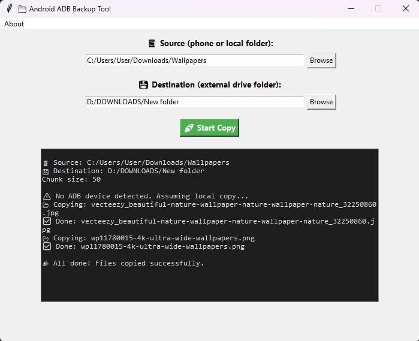

## 📁 Android ADB Backup Tool

> A smart, chunk-based file copier for Android → Windows that skips existing files and prevents device disconnection.

---

### 🧠 Story Behind the Project

Once upon a time, I tried to copy **3,800+ photos and videos** from my **Samsung Galaxy S21** to my external hard drive.
When I selected everything and tried to paste them all at once, my phone **kept disconnecting** in the middle of the transfer.

After multiple failed attempts, I decided to **build my own solution**.

It started as a simple Windows `.bat` script —
👉 `copy_chunk.bat` — which copied files **chunk by chunk** to avoid overloading the transfer process.

That worked perfectly.

Then I thought:

> “Why not make it a proper desktop tool — something anyone can use with just a few clicks?”

That’s how **Android ADB Backup Tool** was born.

---

### ⚡ Features

✅ **Chunk-based copy** — Copies files in small batches (default: 50 files per chunk)
✅ **Skip existing files** — Automatically skips files that already exist at the destination
✅ **Cross-support** — Works with ADB (USB debugging) *or* directly with mounted phone storage
✅ **Simple GUI** — No command line needed
✅ **Safe for large transfers** — Prevents device overload/disconnection
✅ **Logs everything** — See which files are copied, skipped, or failed

---

### 🖼️ Screenshot



---

### 🛠️ Tech Stack

* **Language:** Python 3
* **GUI Framework:** Tkinter
* **External Tool:** ADB (Android Debug Bridge)
* **Platform:** Windows

---

### 🚀 How to Use

#### 1️⃣ Clone the Repository

```bash
git clone https://github.com/<your-username>/adb-backup-tool.git
cd adb-backup-tool
```

#### 2️⃣ Install Python Dependencies

No external libraries required — Tkinter is built-in.
Just ensure **ADB** is installed and available in your system PATH.

#### 3️⃣ Connect Your Phone

* Enable **USB Debugging** (Settings → Developer Options → USB Debugging)
* Connect your phone to your PC via USB
* Verify the connection:

  ```bash
  adb devices
  ```

  You should see your device listed.

#### 4️⃣ Run the App

```bash
python adb_backup_tool.py
```

#### 5️⃣ Choose Folders & Start Copying

* Click **Browse** to select your **source folder** (on phone or local drive)
* Click **Browse** to select your **destination folder** (on external drive)
* Hit **🚀 Start Copy** — sit back and relax 😎

---

### 📂 File Overview

| File                 | Description                                  |
| -------------------- | -------------------------------------------- |
| `adb_backup_tool.py` | Main Tkinter GUI tool                        |
| `copy_chunk.bat`     | Original batch script that inspired the tool |
| `README.md`          | Project documentation                        |
| `screenshot.png`     | App preview image (optional)                 |

---

### 🧩 The Original Batch Script

Here’s a simplified look at the **original version** that started it all:

```bat
@echo off
setlocal enabledelayedexpansion

set "source=C:\Path\To\Phone\Folder"
set "dest=F:\BackupFolder"

set chunk_size=50
set count=0

for %%f in ("%source%\*") do (
    set /a count+=1
    echo Copying: %%~nxf
    copy "%%f" "%dest%\%%~nxf" >nul

    if !count! geq !chunk_size! (
        echo Pausing after !count! files...
        timeout /t 5 >nul
        set count=0
    )
)

echo Done!
pause
```

This small `.bat` file was the foundation — it worked so well that I decided to scale it into a full GUI tool.

---

### 💡 Why This Project Matters

This project shows:

* **Real-world problem solving**
* **Practical automation**
* **Understanding of file handling, ADB, and GUI frameworks**
* **Evolution from script → usable software**

Recruiters and developers can see that this wasn’t just a random demo —
It came from a *real need* and ended up being a *publicly accessible solution.*

---

### 📦 Future Plans

🔹 Add progress bar with live count (e.g., `Copying 34 / 3811`)
🔹 Add pause/resume button
🔹 Add error log export feature
🔹 Create a standalone `.exe` build using PyInstaller

---

### 🤝 Contributions

Contributions, issues, and feature requests are welcome!
Feel free to fork this repo and submit pull requests.

---

### 🧑‍💻 Author

**Programming with Asad**
🎥 YouTube: [Programming with Asad](https://youtube.com/@programmingwithasad)
💼 LinkedIn: [My LinkedIn Profile](https://linkedin.com/in/asadanik)
📧 Email: [engr.asadanik@gmail.com](mailto:engr.asadanik@gmail.com)

---

### ⭐ Show Your Support

If this project helped you save time or solve your phone copy issue,
please give it a **⭐ on GitHub** — it helps others discover it too!
